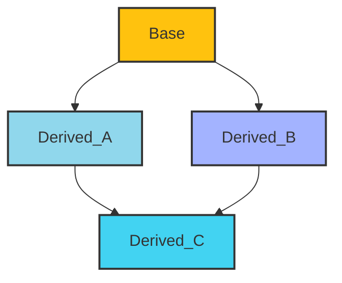
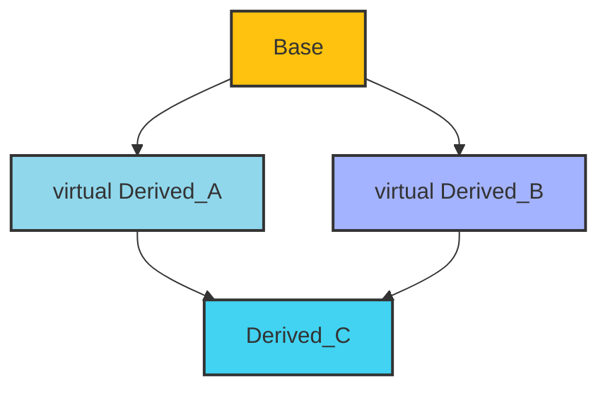

## 基本概念
- 基类 (Base Class): 被继承的类，也称为父类
- 派生类 (Derived Class): 从基类继承的类，也称为子类

## 继承类型
- 公有继承 (public): 基类的公有成员和保护成员在派生类中保持其状态，私有成员则不可被访问
- 保护继承 (protected): 基类的公有成员和保护成员将变为保护成员，私有成员不可访问
- 私有继承 (private): 基类的公有成员和保护成员将变为保护成员，私有成员不可访问
- 虚继承 (Virtual): 一种特殊的继承方式，基类只会被构造一次，确保多个派生类共享同一个基类，一般用于解决菱形继承的问题

## 构造与析构
- 构造顺序: 先构造基类，再构造派生类
- 析构顺序: 先析构派生类，再析构基类
- 虚析构函数: 确保通过基类指针删除派生类对象时，派生类的析构函数将被调用，避免资源泄漏

## 虚函数与多态
- 虚函数: 在基类中声明为 `virtual` 的函数，可以在派生类中重写，支持运行时多态
- 纯虚函数: 在基类中声明为纯虚函数 `(= 0)`，使得基类成为抽象类，不能实例化

### override 和 final 关键字
- override：明确指定一个函数是重写基类的虚函数，帮助编译器检查签名是否匹配。
- final：禁止派生类重写该虚函数，增强代码的可读性和安全性。

## 菱形继承
- 一个派生类同时继承自两个或者更多个派生类，而这些派生类又都直接或者间接的继承自同一个基类

如下图类 A 和类 B 都继承自 Base，类 C 继承自类 A 和类 B 



- 重复构造: 基类的构造函数会被调用多次，每个派生类都会分别构造自己的基类部分，可能导致资源浪费以及状态不一致的问题
- 对象切割: 当基类对象被复制到派生类时，可能会导致对象切割，失去多态性
- 二义性: 访问基类成员是，可能会出现二义性，编译器在不知道调用哪一个派生类的基类部分时会报错

**解决方案**
通过虚继承可以避免菱形继承带来的问题，所有派生类都共享同一个基类的实例，确保基类只构造一次



<details>
<summary> 虚继承示例 </summary>

``` cpp
class Base {
public:
    Base() {
        std::cout << "Base constructed" << std::endl;
    }
};

class Derived_1 : virtual public Base {
public:
    Derived_1() {
        std::cout << "Derived_1 constructed" << std::endl;
    }
};

class Derived_2 : virtual public Base {
public:
    Derived_2() {
        std::cout << "Derived_2 constructed" << std::endl;
    }
};

class Derived : public Derived_1, public Derived_2 {
public:
    Derived() {
        std::cout << "Derived constructed" << std::endl;
    }
};
```

</details>

## 继承中的友元
- 友元类: 友元类可以访问另一个类的私有和保护成员

当一个派生类继承自基类时，基类中的友元关系不会自动继承，基类的友元类或友元函数不能直接访问派生类的私有成员，除非也将他们声明为派生类的友元

<details>
<summary> 可以在基类中声明派生类为友元，允许派生类访问基类的私有成员 </summary>

``` cpp
#include <iostream>

class Base {
    friend class Derived; // Derived 是 Base 的友元类
private:
    int var = 42;
};

class Derived : public Base {
public:
    void accessBase() {
        std::cout << "Accessing Base's privateVar: " << var << std::endl; // 可以访问
    }
};
```

</details>

- 友元函数: 

## 成员隐藏
在派生类中定义与基类同名的成员函数或变量时，基类的成员将被隐藏

<details>
<summary> 适用于同名的函数和变量 </summary>

``` cpp
class Base {
public:
    void display() {
        std::cout << "Base display" << std::endl;
    }
};

class Derived : public Base {
public:
    void display() { // 隐藏基类的 display()
        std::cout << "Derived display" << std::endl;
    }

    void base_display() {
        Base::display(); // 显示基类的 display()
    }
};
```

</details>

